= Internetworking TCP/IP
:hardbreaks:

Internetworking est la technologie qui permet de faire communiquer des réseaux disparates et sert de base à internet. Cela en cachant les détails du matériel réseau.
Internet est un open system interconnection, open car non propriétaire.
TCP/IP est le nom donné à la technologie issue de DARPA pour communiquer entre n’importe quel ensemble de réseaux interconnectés.

Les applications les plus populaires d’Internet :
- WWW : plus grosse source de traffic depuis 1995
- Cloud Access et Remote Desktop
- Transfert fichiers
- Mail
- Services voix et vidéos

Internet fournit 2 services :
- Connectionless Packet Delivery Service : fait suivre des messages courts d’un ordinateur à un autre en se basant sur les informations d’adresse dans le message. Délivre chaque paquet indépendamment mais ne permet pas d’être fiable ou de livrer dans l’ordre. Par contre très efficace.
- Reliable Stream Transport Service : Envoie une communication (même lourde) en la splittant en paquets et les envoyant un à la fois attendant la confirmation de réception du destinataire. Mais transparent pour les applications.

Les fonctionnalités qui distinguent TCP/IP :
- L’indépendance par rapport au réseau
- Une interconnexion universelle : permet à 2 ordi arbitraires de communiquer, chacun se faisant attribuer une adresse qui l'identifie
- End-to-end Acknowledgements : fournit un accusé de réception entre source et destinataire au lieu de le faire pour chaque machine sur le chemin et même si les source et destination ne sont pas connectées à un même réseau physique commun
- Application Protocol Standards : protocoles pour accéder à une page web, transférer un fichier, envoyer un mail

IPv4 et 6 utilisent un paradigme de livraison sans connexion, permettent à l’expéditeur de préciser la taille des données à envoyer et requièrent du destinataire de spécifier le nombre maximum de sauts du paquet envoyé. IPv6 est de l’IPv4 avec des modifications mineures selon ses concepteurs.
Les changements introduits :
- Des adresses plus larges : sur 128 bits au lieu de 32
- Une hiérarchie d’adresse étendue : utilise les adresses plus larges pour créer des niveaux additionnels. Un fournisseur d’internet peut ainsi allouer des bloc  d’adresses à chaque client
- Nouveau format d’en-tête : un format de paquet entièrement nouveau et incompatible qui inclut un ensemble d’en-têtes optionnelles
- Options améliorées : le paquet peut contenir des informations de contrôles non dispo dans v4
- Place pour de l’extension de protocoles : réfléchi pour permettre à l’IETF d’adapter le protocole à du nouveau matériel réseau et de nouvelles applications
- Support pour l’autoconfiguration et le renumbering : permet à un site de changer d’un fournisseur interent à un autre en automatisant le changement d’adresse requis
- Support pour l’allocation de ressources : inclus une abstraction de flux et permet des services différenciés

== Survol des technologies sous-jascentes
Les 2 catégories de technologies packet switched (selon capacité et usage) : WAN (Wide Area Networks) et LAN (Local Area Networks).
Les débits typiques pour le premier de 100Mbps à 10 Gbps avec des délais allant de quelques ms à plusieurs dizaines de secondes et pour le second de 1 Gbps à 10 Gbps pour des 1/10e de ms à 10 ms.

Ethernet : techno la plus populaire pour du LAN. 2 versions utilisées actuellement GigE (1 Gigabit Ethernet) et 10GigE.

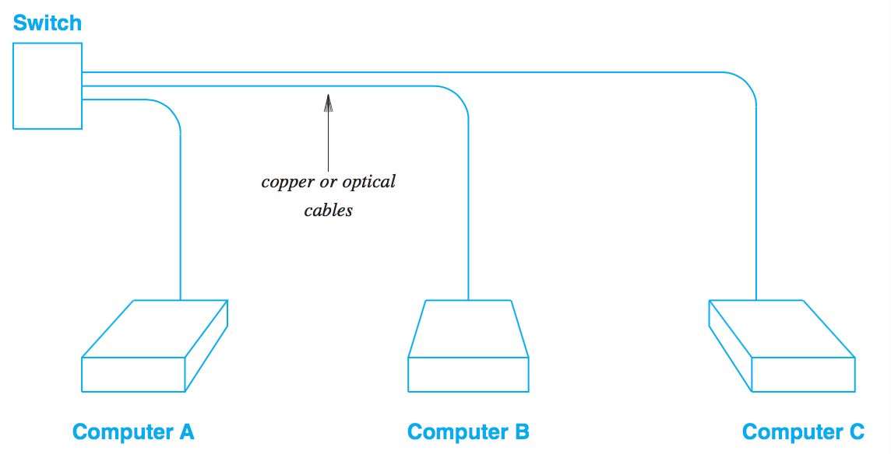

Le switch est un appareil électronique résidant dans une armoire de branchement. Quand on utilise du cuivre, les câbles ne doivent pas dépasser 100m. Chaque ordi a un NIC (Network Interface Card) qui reçoit et envoie les paquets.
L’avantage de l’optique : pas d’interférence électrique et une plus grande capacité.
Quand un cable est branché, une négociation s’instaure, le switch pouvant travailler sur plusieurs vitesses ( 10, 100, 1000, 10000 Mbps). Ils s’accordent sur la vitesse de travail maximum du plus faible des deux. Ce qui permet de la rétro compatibilité. Le format de paquet ne dépend pas la vitesse d’échange.
Ethernet supporte le broadcast (livraison à tous les ordi du réseau). En pratique Ethernet fait une copie du paquet pour chaque ordinateur. TCP/IP dépend du broadcast.
Ethernet pratique le Best-Effort Delivery Semantics. Cela veut dire qu’il ne garantit pas l’arrivée du paquet et ne prévient pas l’expéditeur de la non réception du paquet. De plus si plusieurs ordinateurs essaient d’envoyer des paquets au même ordi au même moment, le switch peut devenir surchargé et commencer à rejeter des paquets.
IEEE définit une adresse MAC sur 48 bits qui est utilisée par Ethernet et d’autres techno réseaux. Pour s’assurer de l’unicité, un fabriquant de matériel Ethernet achète des blocs d’adresses. MAC == adresse physique ou matériel. *L’adresse MAC est liée à la NIC pas à l’ordinateur, si on change la carte, l’adresse change également*.
MAC fournit 3 types d’adresses : unicast, broadcast (que des 1) et multicast.
Un multicast est une forme limitée de broadcast qui est un sous ensemble de machines dans un réseau. TCP/IP utilise multicast et IPv6 en dépend.
Une frame Ethernet fait entre 64 et 1514 octets.

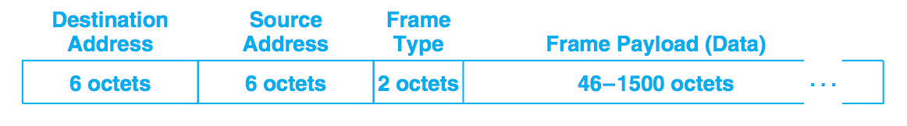

Les 3 premiers champs constituent l’en-tête.
La plupart des technologies réseaux schématisent leurs paquets de la même façon.
Le payload d’Ethernet est devenu le standard et les fournisseurs conçoivent leurs réseaux pour tenir 1500 octets de données.
Le frame type permet à une machine donnée d’identifier le protocole module qui doit traiter le paquet.

Le numéro de standard le plus connu pour Wi-Fi, 802.11 suivi d’un suffixe. 2 formes de connexion : une station connectant à plusieurs clients, du point à point.
Un standard plus rapide, pensé initialement pour du point à point, Wi-MAX (802.16), intéressant pour les fournisseurs de réseaux ou les entreprises voulant relier 2 sites.

ZigBee (802.15.4) pour les objets connectés avec une techno basse énergie radio. Les paquets font 127 octets dont 102 pour le payload. 2 formats d’adresses MAC, 64 et 16 bit.

VLAN (Virtual LAN) est une forme plus avancée de switch, permettant de traiter un switch comme plusieurs petits switchs. Chacun est un VLAN qui est déterminée par les ordinateurs qui y sont connectés
VLAN peut servir à séparer des ordinateurs en fonction de politiques différentes (employés, visiteurs).
Chaque VLAN définit un domaine de broadcast, un paquet envoyé en broadcast sur un VLAN n’est délivré qu’aux ordinateurs qui lui sont connectés.
Du point de vue des protocoles Internet un VLAN est considéré comme un réseau physique séparé.

Le bridging permet de transporter une copie d’un paquet d’un réseau à un autre. Permet de former un unique grand réseau en reliant des réseaux plus petits. Il n’effectue aucun changement sur le paquet. Ce qui permet à 2 ordinateurs sur 2 réseaux de communiquer, les sources et destinations n’étant pas altérées. Le bridge est dit transparent.
A l’origine les bridges étaient des équipements à part. Avec les techno modernes de switch, les bridges ne sont plus faisables à part et sont embarqués dans d’autres appareils.
Cette technique cachant les détails d’interconnexion un ensemble d’Ethernet bridgés agit comme un seul.
En fait son comportement est plus intelligent pour savoir quel paquet faire suivre. Ils sont appelés bridges apprenant parce qu’ils utilisent le traffic pour déterminer quel ordinateur est sur quel réseau. Le bridge enregistre l’adresse source. Dans un réseau type chaque ordi envoie un broadcast ou un multicast permettant de connaître son adresse. Quand le bridge reçoit un paquet si les source et destination font parties du même réseau, le paquet n’est pas envoyé par le bridge.
Cela permet au bridge d’être transparent et automatique et d’améliorer la performance.

Les réseaux sont sujet à congestion et perte de paquets. Dans l’exemple ci-dessous si chacun des ordinateurs opère à 1Gbps, le destinataire C ne peut consommer que la moitié de ce qui lui est envoyé. On a donc une congestion au niveau du switch, qui commencera à rejeter des paquets dès que ses buffers seront pleins.

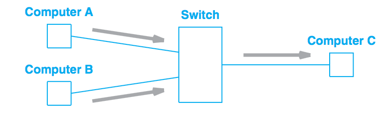

== Concept d’Internetworking et modèle architectural
Jusqu’à présent que les détails bas niveau. Le but de cette partie, décrire un schéma nous permettant de connecter les différentes technologies réseau en un tout coordonné, un système cachant les détails du matériel réseau en dessous.
La première méthode utilisée par les designers pour interconnecté était au niveau application. Par ex, chaque fournisseur de mails avait ses propres conventions. Pour les communications entre fournisseurs, la communication était traduite par un logiciel tournant sur un ordi connecté aux 2 systèmes.

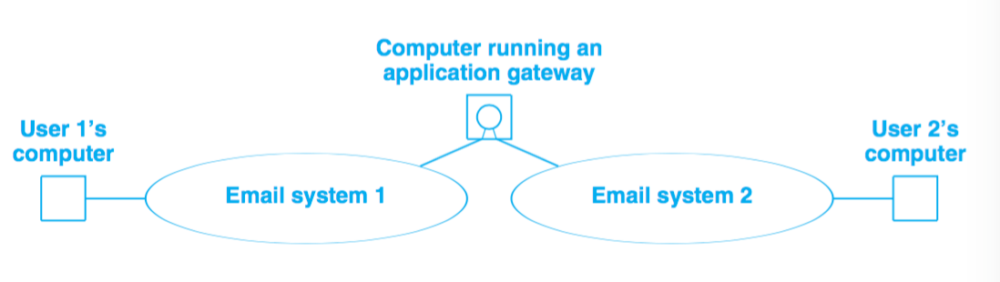

Cette application devait à la fois comprendre les détails des connexions réseau et les protocoles de message.
Parce qu’une application se charge des détails réseau, aucun matériel n’est nécessaire en plus.
Le problème c’est qu’un tel gateway ne peut gérer qu’une application (pas transférer des fichiers par ex). De plus s’il y a des différences dans les fonctionnalités des systèmes (par ex un système permet d’envoyer des fichiers et pas l’autre), l’application ne peut transmettre les messages. Enfin chaque fois qu’un système géré change, le système doit être mis à jour.
Quand plus de 2 systèmes doivent être connectés les combinaisons de traduction explosent rapidement. La stratégie pour traduire de A vers C par ex consistait à traduire sur le premier gateway de A vers B puis de B vers C. Mais si l’un des éléments de la route tombe la communication est compromise sans possibilité pour les source et destination de détecter le problème.
On ne peut avec cette approche garantir une communication fiable.

Une autre approche est de se passer d’intermédiaire et de passer directement des paquets de la source au destinataire. En se basant directement sur le réseau, la communication est très efficace. L’interconnexion réseau permet de passer le message sans que les intermédiaires ait besoin de le comprendre. Cela permet également de garder un système souple qui n’adhère pas à des besoins spécifiques. Cela permet aux managers de réseaux de changer la technologie des réseaux sans toucher aux applications qui l’utilisent.
L’*internetworking* permet de détacher les notions de communication des détails des technologies réseaux et cache les détails bas niveaux aux utilisateurs et applications.
2 observations fondamentales sur la conception des systèmes de communication : aucun matériel réseau unique peut satisfaire toutes les contraintes ; les utilisateurs désirent une interconnexion universelle.
La première contrainte est économique et permet de répondre spécifiquement à des contraintes, du LAN pour les courtes distances qui ne revient pas cher, du W(ide)AN pour les longues distances car cher.
C’est du logiciel inséré entre les mécanismes de communication dépendant de la technologie et les applications qui cache les détails bas niveaux.

L’un des premiers principes de cette conception se concentre sur l’encapsulation, cacher l’architecture internet sous-jacente qui permet de travailler dessus sans en connaître la structure. Rajouter un noeud ne doit ni revenir à ajouter un point à un switch centralisé ni impliquer un lien physique direct avec tous les réseaux existants. Tous les ordinateurs dans internet partagent un ensemble universel d’IDs machines (noms ou adresses).
Cette notion d’internet unifié inclut aussi l’idée d’indépendance entre ordi et réseau. L’ensemble des opérations pour établir une communication doit être indépendant de l’infrastructure réseau utilisée.  Le programmeur peut alors ignorer la typologie réseau ou le type d’ordinateur destinataire.

2 réseaux ne peuvent être physiquement directement reliés et cela ne répond pas au principe d’interconnexion évoqué. Pour cela des ordinateurs spéciaux sont requis ayant la volonté de transmettre les paquets. Ce sont des routeurs internet ou routeurs IP.
Ces routeurs ont pour destination un réseau pas un ordinateur en particulier. La quantité des informations qu’il a à retenir est proportionnelle au nombre de réseaux (bien moins important que le nombre d’ordinateurs).

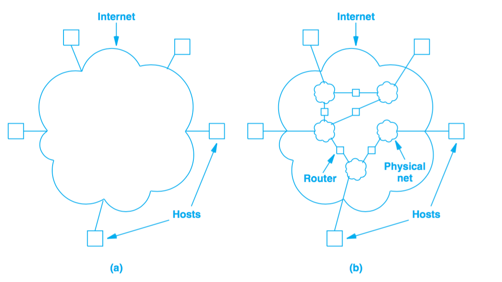
(a) représente la vision de l'utilisateur, internet comme un système unifié. (b) montre les interconnexions routeurs/réseaux.
Les applications comme les réseaux physiques ne savent les uns des autres, les derniers se contentant de transporter des paquets.
Ce système est très similaire à un réseau de routes locales se connectant à des autoroutes.

== L’assemblage en couches de protocoles
Les protocoles permettent de spécifier et comprendre une communication sans connaître les détails d’implémentation d’un fournisseur particulier. Le format d’une trame Ethernet fait partie d’un protocole.
La communication sur un réseau est complexe et impacté par de nombreux problèmes : la panne de matériel, la congestion du réseau à cause de sa capacité finie, les retard ou perte de paquets, la corruption de données à cause d’interférences électriques ou magnétiques, la duplication de données ou les arrivées inversées de données.
Etant conséquents, ces problèmes ne peuvent être résolus qu’en les gérant séparément.

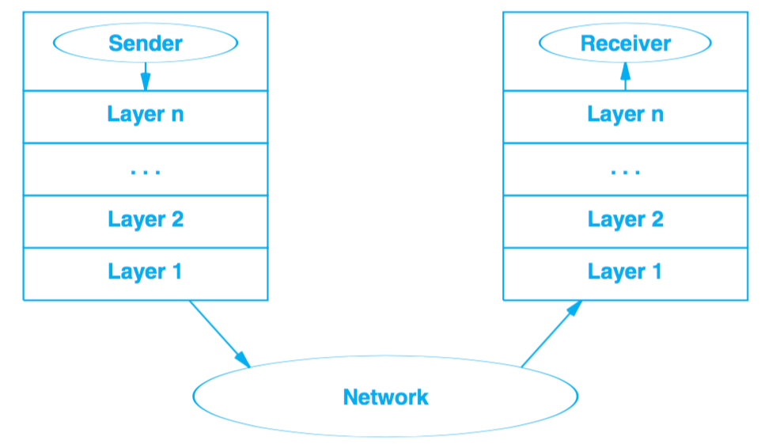
Le premier modèle en couches débouche d’un travail préliminaire de l’International Organisation for Standardization. Il préempte les travaux sur Internet mais ne les décrit pas bien et contient des couches qui ne sont pas exploitées par TCP/IP.

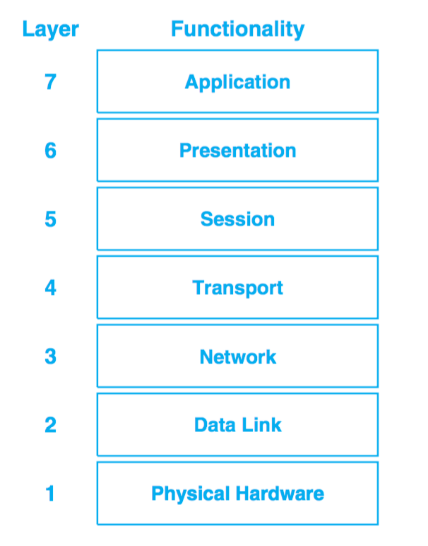

=== L’exemple X.25
ISO a été utilisé pour les premiers protocoles d’implémentation, dont les plus connus et utilisés sont les protocoles X.25. X.25 est une recommandation de l’International Telecommunications Union (standards for international telephone service). Avec X.25, le réseau opère comme un système téléphonique, consistant en switches de paquets contenant l’intelligence pour les diriger. Les ordinateurs ne sont pas directement reliés aux fils du réseau mais à un des switches de paquets en utilisant une ligne de série de communication. Cette ligne de série  ordi switch est comme un mini réseau.
Dans sa *couche physique*, il spécifie un standard pour la communication  entre ordi et le switch de paquets incluant notamment les caractéristiques de voltage et de courant.
Dans la *couche de lien de données*, il décrit comment les données vont de l’ordi au switch. L’unité transportée est appelée frame. Elle inclut une détection d’erreurs pour se prémunir des erreurs de communication et un mécanisme de timeout faisant renvoyer le paquet jusqu’à une transmission réussie. La réussite dans cette couche consiste à faire parvenir le paquet au switch et pas après.
Dans la *couche réseau*, on définit l’unité de base de transfert dans le réseau incluent la destination et le forwarding. Les couches 2 et 3 étant indépendantes, la taille des paquets de la couche 2 peut être plus petite que celle de la couche 3.
La *couche de transport* garantit la fiabilité E2E en faisant communiquer source et destination. Elle fait un contrôle en plus de ceux fait plus bas pour s’assurer qu’aucune machine participant à la communication ne se plante.
La *couche de session* vient de l’origine du modèle ISO. A l’époque, les réseaux étaient utilisés pour connecter un terminal (clavier + écran) à un ordinateur lointain. Il se concentrait donc sur l’accès à un terminal et gérait ces détails.
La *couche de présentation* standardise le format de données que les applications envoient sur le réseau. Le désavantage est que ça inhibe l’innovation, les nouvelles applications devant suivre le format de données. Des groupes spécifiques s’arrogent le droit de standardiser pour leur domaine en particulier plutôt que de faire un standard plus général. Cette couche est souvent ignorée.
La *couche de présentation* concerne les applications utilisant le réseau (SMTP, FTP…).

TCP/IP définit un modèle sur 5 couches mais qui ne découle d’un corps de standardisation formel mais de chercheurs qui ont conçu Internet.

image::internetworking_tcp_ip/layer_5_version.png[Couches dernière version]
Les utilisateurs utilisent des applications accédant à des services par l’internet TCP/IP.
La *couche d’application* interagit avec celle de transport en envoyant/recevant des données. Chaque application choisit le style de transports (séquences de messages ou flux continu d’octets).
La *couche de transport* fournit la communication d’une application à une autre. Cette communication est appelée E2E cat elle connecte 2 points finaux et non des routeurs intermédiaires. Elle peut réguler le flux d’informations. Elle peut aussi assurer la fiabilité du transport en s’assurant de l’arrivée des données. Le protocole fait retourner au destinataire une confirmation de réception. Le stream de données est transmis divisé en petites parties qui sont passées avec l’adresse de destination à la prochaine couche. Cette couche doit pouvoir accepter des données de plusieurs applications à transmettre. Elle ajoute des infos additionnelles à chaque paquet identifiant l’application source et la destinataire. Les protocoles de transport utilise un checksum pour se protéger d’erreurs causant le changement des bits. Le destinataire utilise ce checksum pour vérifier que le paquet transmis est bon.
La *couche internet* s’occupe de la communication d’ordinateur à ordinateur. Elle accepte la requête d’envoi de paquet avec une identification de l’ordinateur destinataire. Elle encapsule le paquet de transport dans un paquet IP, remplit les headers et l’envoie directement à la destination ou à un routeur intermédiaire. Cette couche reçoit également des paquets, vérifie leur validité et utilise un algo décidant si le paquet doit être traité localement ou envoyé au prochain point. Pour les paquets destinés à la machine, il détermine quel protocole de transport sait traiter le paquet.
La *couche d’interface réseau* accepte des paquets IP et les transmet sur un réseau spécifique. C'est un driver  (sur un LAN) ou un sous-sytème complexe implémentant un protocole data link. Certains pro du réseau ne les distingue et utilise les termes couche MAC ou couche data link.
Chaque couche prend des décisions sur la justesse du message et choisit l’action appropriée en se basant sur le type du message ou l’adresse de destination.

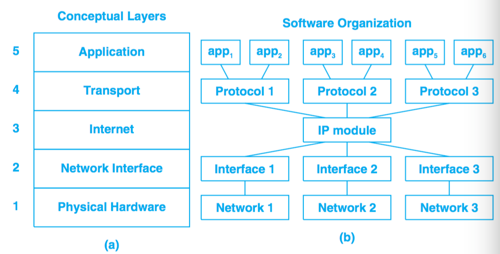

Un exemple de message transmis bout à bout.

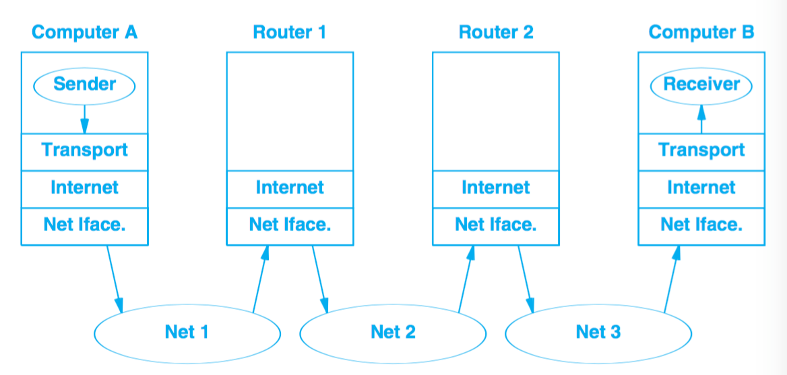

Contrairement au modèle X.25 où l’intelligence est localisée dans les switchs, ce modèle place beaucoup moins d’intelligence dans le réseau et plus dans les systèmes clients (les ordinateurs des utilisateurs). Ces derniers comprennent les couches 2 et 3. TCP/IP peut être vu comme un simple système de livraison de paquets auquel s’attache l’intelligence des hôtes qui y sont connectés.
Les protocoles en couche sont conçus afin que la couche n de la destination reçoivent exactement le même objet que la couche n de la source.
Ce principe offre une *indépendance de conception des protocoles*. On peut alors se concentrer sur une couche en faisant abstraction des autres sachant qu'elles n’altèreront pas le message.
Un *protocole est dit E2E* s’il fournit une communication de la source à la destination. Les autres sont appelés machine à machine car la couche n’assure qu’un hop réseau.

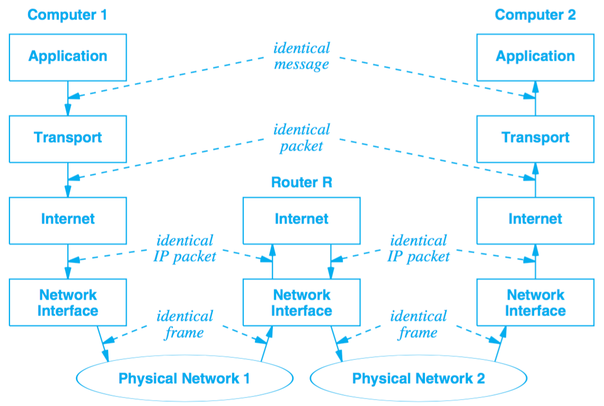

La figure montre que les couches interface de réseau et internet sont machine à machine tandis que les autres sont E2E.
La couche internet assure qu’un paquet IP parte de la source à la destination. Mais le paquet contenant des champs comme le time to live qui change chaque fois que le paquet est passé à un routeur, la destination ne voit finalement pas le même paquet que la source (http alors ?).
La technologie matériel utilisé dans la plupart des réseaux garantit que tous les ordinateurs attachés puissent atteindre les autres ordinateurs directement. Mais dans les technos radio comme ZigBee, ce n’est pas le cas, dû notamment aux interférences.
Chaque radio n’atteint qu’un sous-ensemble de noeuds et un circuit digital ne relie que 2 radios. On parle alors de *réseau mesh* caractérisant un système communication constitué de plusieurs liens individuels.
Ce réseau mesh peut être vu de 2 façons dans le modèle en couche en fonction de la façon dont il fait suivre les paquets. Si c’est sur la couche 2, le mesh peut être modélisé comme un seul réseau physique. On parle alors de *mesh under*. Si IP se charge de faire suivre les paquets, le mesh est modélisé comme un réseau individuel, on parle de *IP route-over* ou simplement *route-over*. C’est ce que la plupart des réseaux d’ISP utilisent.
Zigbee peut être configurer pour travailler en mesh under ou former des liens individuels et laisser IP se charger du forwarding.

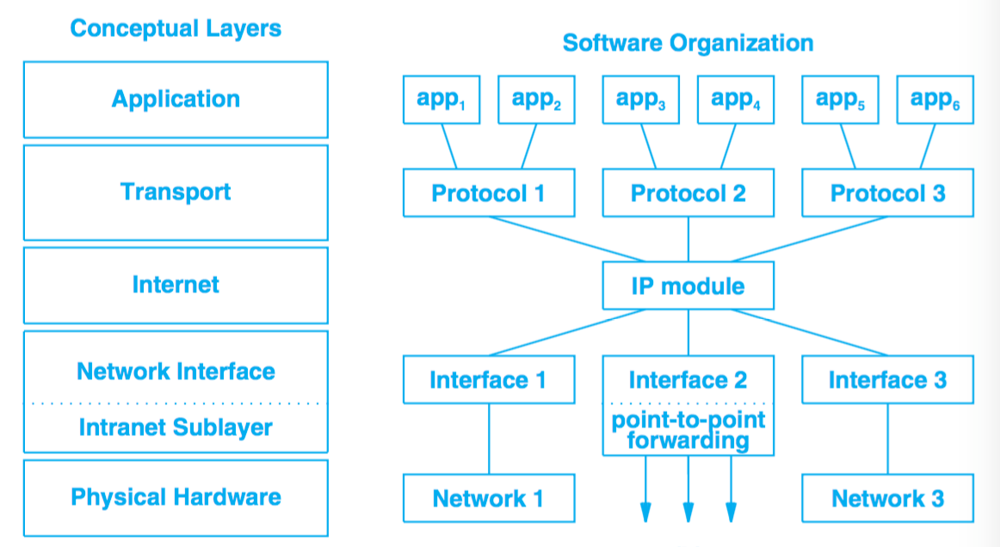

Introduction de la sous-couche intranet pour du forwarding point à point
Zigbee utilise un protocole de routage spécial qui apprend les destinations dans le mesh et configure ensuite l’IP forwarding vers les différents liens. Le principal désavantage est que ça démultiplie les routes au niveau IP (une pour chaque paire), créant une table de routage beaucoup plus grosse que nécessaire.
Le principal défaut du mesh under est qu’il crée une table séparée pour faire suivre les paquets et utilise un protocole de routing séparé pour mettre à jour sa table. Le protocole de routage en plus entraîne un traffic en plus mais le réseau mesh étant beaucoup plus petit qu’Internet et donc plus statique, un protocole dédié peut être plus efficace que d’utiliser le protocole de routage IP. Le dernier problème du mesh est que le routage intranet prend le pas sur l’IP et peut rendre les problèmes de routage plus difficiles à debugger.

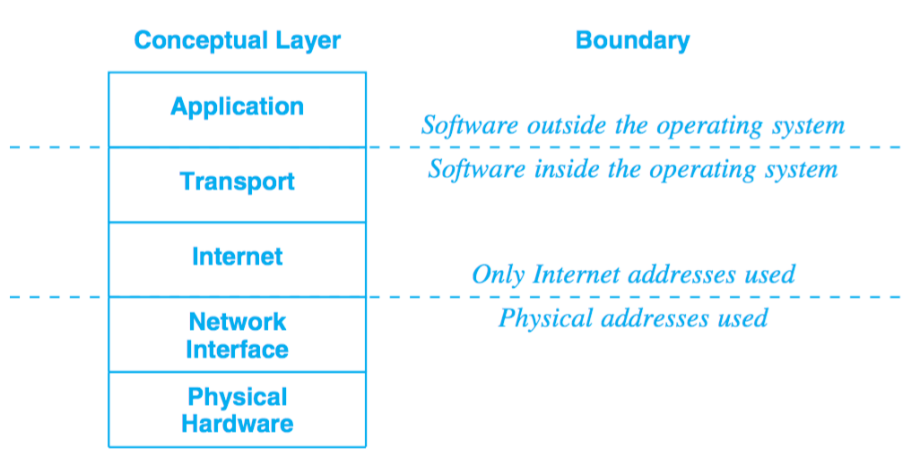

Les adresses physiques sont les adresses MAC.

Les couches permettent de diviser un gros problème en plusieurs sous-problèmes. Mais utiliser des couches strictes nuit à la performance, car si l’on a aucune connaissance de la couche du dessous, on ne peut optimiser les envois.
Quand on construit un protocole, les constructeurs s’autorisent d’obtenir certaines informations comme la taille maxi des paquets ou la route qui est utilisée. Ainsi la couche transport en ayant l’information sur la taille peut laisser la taille nécessaire pour les en-têtes ajoutées par les couches basses et optimiser son envoi. Les couches basses retiennent souvent les en-têtes en passant les paquets aux couches supérieures.

Chaque frame Ethernet a un champs type indiquant ce que la frame transporte (paquet IP, ARP ou RARP).

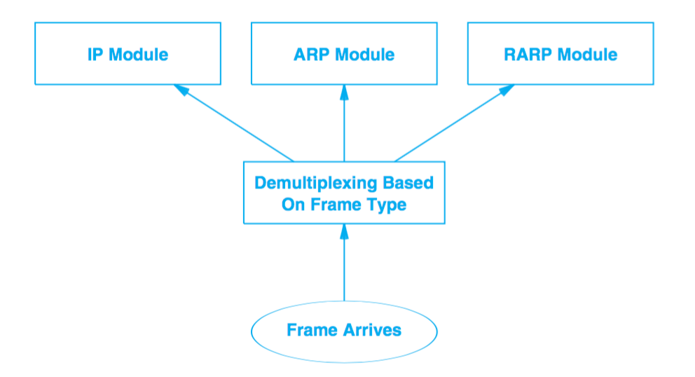

On a du multiplexing et du demultiplexing à tous les étages. Demultiplexer permet d’orienter le paquet vers le bon module après vérification de l’intégrité du paquet.
Les paquets IP ont aussi un champ type dans l’en-tête permettant de choisir vers quel protocole de transport envoyer le paquet (TCP, UDP, ICMP).
L’accord sur les types et la gestion des types ignorés sont traités dans les protocoles.

=== Adressage d’Internet
Un hôte (host) : un endpoint connecté à internet comme imprimante réseau, PC, tout appareil qui n’est pas un routeur.
Les adresses binaires ont été choisies pour identifier un hôte pour avoir une sélection de next hop efficace.
Chaque hôte se voit attribuer une *IP address* (Internet Protocol Address).
Les addresses sont choisies avec soin pour permettre un forwarding efficace.
Tous les hôtes sur un même sous-réseau partagent le même préfixe. En fait une adresse est constituée d’un netid (identifiant de son réseau) et d’un hostid. Un netid sur beaucoup de bits permet d’avoir beaucoup de réseau mais peu d’hôtes dans ces réseaux. Et inversement, un netid réduit diminue le nombre de réseaux mais augmente le nombre d’hôtes sur ceux-ci.
Sur 32 bits pour IPv4 et 128 pour IPv6.

==== Schéma IPv4
Dans IPv4, 5 classes d’adresses

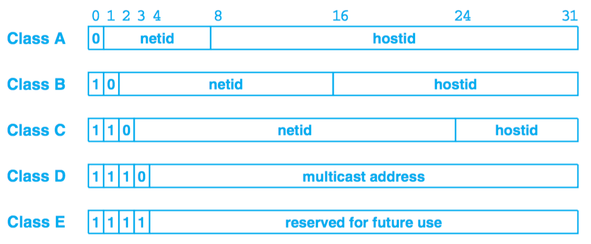

La frontière entre préfixe et suffixe peut être calculée à partir de l’adresse elle-même qui est alors qualifiée de self-identifying. La classe est déterminée par les 3 bits forts, les 2 premiers étant même suffisants pour distinguer parmi les 3 premières classes.
La classe A utilise  7 bit pour l’ID du network et 24 pour l’ID de l’host, pour la classe B, 14/16, pour la classe C, 21/8.
On appelle dotted decimal notation, la notation séparant l’adresse en 4 décimaux séparés par des points représentant chacun 8 bits de l’adresse.
Pour répondre au manque d’adresses tout en utilisant le même schéma d’adressage, on utilise le *subnetting* ou adressage de sous-réseau.

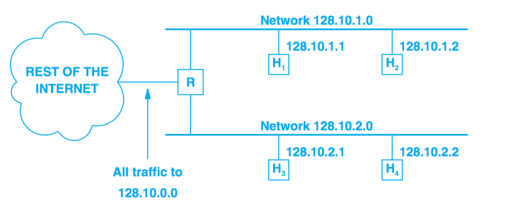

Dans l’exemple ci-dessous le 3e octet est utilisé par un routeur pour déterminer dans quel sous-réseau envoyer le paquet.
Pour le subnetting on exploite l’adresse de la façon suivante

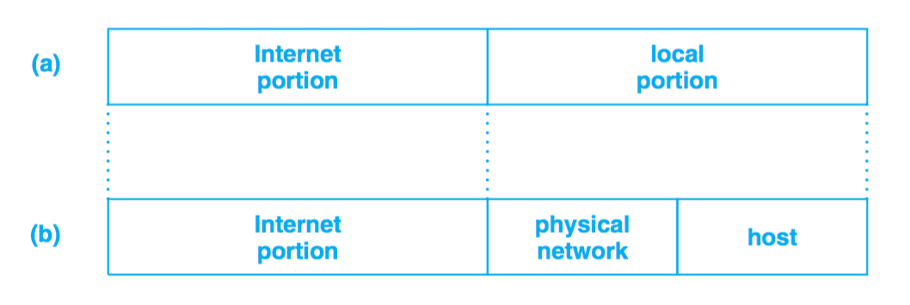

2 techniques de *subnetting* : *fixe* et *variable*.
Dans la première, on fixe une part des 16 bits pour identifier le sous-réseau. Plus on utilise de bits, plus on a de réseaux et moins on a d’hôtes sur chaque réseau. Cette technique est plus facile à comprendre et administrer.
On utilise la seconde quand on s’attend à des différences sur la taille des sous-réseaux. Le standard dit qu’on peut sélectionner une partition sous-réseau par réseau. On choisit une partition pour un sous-réseau donné puis les hôtes et routeurs qui y sont rattachés suivent cette décision sous peine de perte de paquets. Ce qu’il faut éviter est l’ambiguïté dans les adresses qui fait qu’une même adresse soit interprétée de 2 façons par 2 réseaux physiques différents.

Un *masque de sous-réseau* est composé de 1 sur les bits qui constitue l’identifiant sous-réseau et de 0 sur la partie hôte.
11111111 11111111 11111111 00000000 pour un sous-réseau avec ID sur 12 bits. Ce masque s’exprime aussi en décimal séparé de points. Il peut s’exprimer en tuple de 3 éléments {<ID réseau>, <ID sous-réseau>, <ID hôte>}. Dans cette notation -1 signifie tous les bits à 1. 255.255.255.0 == {-1, -1, 0}. Ex.: {128.10, -1, 0}. Mais cette notation n’indique pas sur combien de bits est codée chaque partie.

Pour s’accommoder temporairement de la croissance du réseau, le *classless addressing* a été introduit, supprimant les classes A, B et C, la D ayant été gardée pour le multicast. La techno est connue sous le nom *CIDR* (Classless Inter-Domain Routing). Cette techno a permis de pallier la vitesse de consommation des classes B par les grandes structures.
Le supernetting qui en découle permet d’utiliser un ensemble d’adresses de classe C contigues à la place d’une classe B. Pour une organisation de 200 réseaux, on assignera 256 adresses car le nombre d’adresses assignées doit être une puissance 2. CIDR utilise aussi un masque de 32 bits pour délimiter la frontière entre préfixe et suffixe. CIDR préconise la notation suivante précisant la taille du masque pour une adresse : *128.211.168.0/21*. Un ISP peut alors choisir le nombre d’adresses à allouer à un utilisateur en fonction de ses besoins.

Pour un intranet, on évite d’utiliser des adresses dites routables pour éviter qu’elle ne soit envoyée par erreur sur le net. On utilise des *adresses privées*: 10.0.0.0/8 -> 10.255.255.255, 172.16.0.0/12 -> 172.31.255.255, 192.168.0.0/16 -> 192.168.255.255, 169.254.0.0/16 ->169.254.255.255

==== Schéma IPv6
Sur 128 bits. Elles sont assez larges pour que chaque personne ait la sienne.
La notation décimale précédente serait trop longue, on utilise donc une notation hexadécimale séparée par 2 points.
**68E6:8C64:FFFF:FFFF:0:1180:96A:FFFF
FF05:0:0:0:0:0:0:B3 <==>FF05::B3**
Les 0 successifs sont remplacés par des 2 points pour simplifier l’expression. Mais il ne peut être utilisé qu’une fois par adresse pour éviter les ambiguïtés (la plage de définition de chaque raccourci).
2 difficultés : assignation par des humains et la gestion des tables de forwarding par les routeurs.
Les adresses étant suffisamment larges, elles permettent une hiérarchie plus riche que l’adressage précédent qui n’avait que 2 parties, préfixe et suffixe. On peut ainsi avoir 3 niveaux d’ISP décroissants en taille qui gèrent le routage des paquets avant d’arriver sur un réseau.
L’espace des adresses ressemble à celui à classes d’IPv4. Les 8 premiers bits suffisent à identifier les types basiques.

Pour la transition, on embarque des adresses IPv4 dans des v6. Toute adresse commençant par 80 bits à zéro suivis de 16 bits à un contient sur les 32 derniers bits la v4 et est une *adresse de transition*. Un ensemble d’adresses est réservé au *protocole SIIT*.

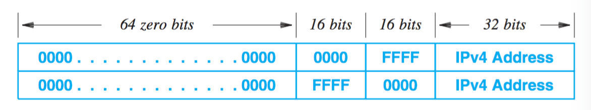

En plus d’embarquer la v4 dans la v6, les paquets doivent aussi être traduits au format v6.
L’adresse pourrait faire échouer les vérifications checksum au niveau TCP et UDP, celles-ci intégrant l’adresse. Pour résoudre ce problème le complément du checksum pour la v4 est la même que pour sa version embarquée v6.

Les v6 sont divisées en 3 parties : un préfixe utilisé pour identifié le site, un ID de sous-réseau pour distinguer les différents réseaux physiques sur le site et un ID d’interface pour identifier l’ordinateur dans le réseau

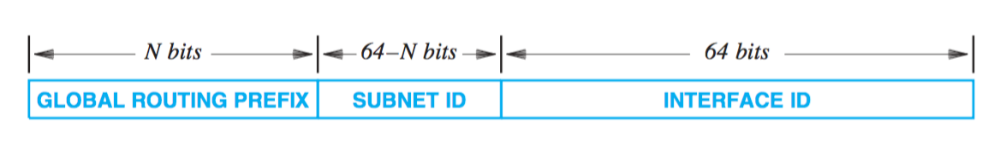

On parle d’ID d’interface au lieu d’ID d’hôte pour identifier le fait qu’un même noeud/ordi peut avoir plusieurs interfaces de connexion et donc plusieurs IDs. Le MAC peut être utilisée comme ID unique, v6 étant assez large pour le contenir, ce qui permet de le retrouver de façon triviale, la totalité du réseau devant au préalable s’accorder sur la même représentation.
*Une adresse, étant donné qu’elle identifie à la fois un réseau et un hôte, identifie une connexion à un réseau (valable pour v4 et v6)*.
v6 établit bien cette différence en identifiant une adresse d’interface.

=== Les adresses spéciales
L’ID d’hôte constitué uniquement de 0 est réservé pour le réseau.
L’ID d’hôte constitué uniquement de 1 est l’adresse de broadcasting sur le réseau. Le *broadcast* est implémenté soit par le matériel (Ethernet) soit par le logiciel au-dessus (v4). Beaucoup de sites rejettent ce genre de requêtes car potentiellement dangereuses.
Le *broadcast local/limité* utilise une adresse constituée de 32 1s. Peut être utilisé par l’hôte pour connaître son adresse ou celle du réseau au départ. Ensuite on lui préfèrera le broadcast normal.
Le *broadcast de sous-réseau* utilise l’adresse network:subnet:{1}.
L’*adresse constituée uniquement de 0* est réservée au cas où l’hôte doit communiquer mais ne connaît pas son adresse. Par ex pour connaître son IP il envoie un datagramme au broadcast limité en se donnant pour identité cette adresse. Le receveur lui envoie alors une réponse avec une méthode spéciale.
Les requêtes à plusieurs points spécifiques sont appelées *multicast*. Elles sont envoyées à des *IP commençant par trois 1*.
*127.0.0.0/8* est le préfixe de l’*adresse de loopback*. Par convention on utilise 127.0.0.1 mais un autre hôte peut être utilisé car TCP/IP n’examine pas l’hôte. Les paquets envoyés sur cette adresse sont directement adressés au module les gérant.

image::internetworking_tcp_ip/special_v6_addresses.png[Adresses v6 spéciales]

Sur v6 point de broadcast mais du multicast, les applications ayant plus besoin de communiquer avec un groupe d’applications qu’avec l’ensemble du réseau. v6 définit un groupe multicast *all hosts* et un *all nodes* (tous les hôtes et routeurs).
v6 introduit une adresse dite *anycast* pour gérer la réplication serveur. Des serveurs identiques sont déployés à différents endroits du net et partagent une adresse anycast. Une requête vers cette adresse est envoyée au serveur le plus proche.
Elle a également un ensemble de préfixes d’adresse dit *link-local* qui ne sont pas valides globalement et ne sont utilisables que sur le réseau porteur, gérés par les routeurs. Elles donnent un moyen de parler à ses voisins sans que les paquets n’arrivent sur internet.

Un défaut de ces adresses est que changer un ordinateur de réseau change son adresse de contact. La faiblesse de v4 vient du fait que fixer le préfixe limite le nombre d’hôtes pouvant être gérés dans le réseau. Pour gérer la croissance on peut être obligé de changer le schéma si on dépasse la limite initiale.
Pour faire suivre les paquets, on se sert de la portion réseau de l’adresse. Pour un hôte avec de multiples adresses, le chemin pris par le paquet va dépendre de l’adresse utilisée pour communiquer. En fonction de celle-ci, le chemin va être plus ou moins long. Connaître une seule adresse de destination peut donc ne pas être suffisant dans ce cas.

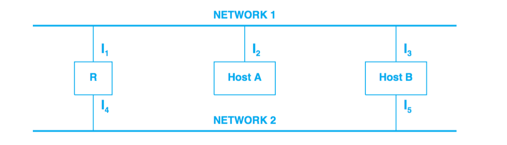

Dans le schéma suivant A et B sont reliés aux réseaux 1 et 2. Accéder à A est plus rapide par le réseau 1 et B par le réseau 2.

Chaque préfixe réseau est unique et assigné par un organisme central. A l'origine par l’IANA, maintenant par l’ICANN qui s’occupe de tous les noms et autres constantes utilisées dans les protocoles et notamment les adresses.
ICANN distribue des blocs aux registres régionaux (ISPs majeurs).
