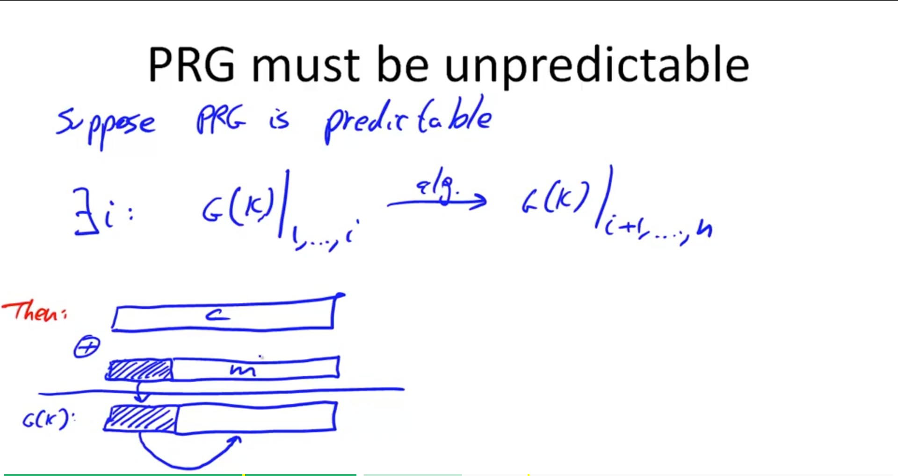

# Cryptography: Week 1

## Cryptography core
Secret key establishment
secure communication: confidentiality (noone in the middle understands the content), integrity (nobody can tamper
the message without beign detected)
digital signature: without being able to copy my digital signature using one of my documents
Anonymous communication: mix net ==> Anonymous digital cash: preventing cash replication, by exposing identity if cash is spent more than once

Secure multi-party computation ; for election or private auctions protocols for exemple
Its goal: compute f(x1, x2, x3, x4) by a trusted authority
Thm: anything that can be done with trusted auth can also be done without

Privately outsourcing computation: process an encrypted query, without knowing the plain content and send back the encrypted results that only the client
may see
Zero knowledge: prove that you know the solution of a problem without revealing the solution

3 steps:

- Specify the threat model
- propose a construction
- Prove that breaking the construction under threat model will solve a really hard problem

## History
Symmetric cyphers

### Substitution cypher (BROKEN)
Each letter is mapped to another                                                                                         
Caesar cypher is a substitution cypher (a false cypher because no key) which shifts letters given a step
|K| = 26! roughly 2^88 which is a good key space size
Break by letter frequencies or frequencies of pair of letters (digrams) then trigrams
### Vigener cipher (BROKEN)

1. Know the length of the key
2. Pick the first letters in each group of key length, the one with the most occurence is e
3. The key letter is e minus the corresponding encrypted character
4. The other key characters are cracked the same way
When we don’t know the key length we increment the value from 1 with the same process until we find the key

### Enigma (BROKEN)
Uses the rotor technique (4) and had a relatively small key space. 26^4 = 2^18 rotor position ==> 2^36 keys due to optional plugboard
Can be brute force in a matter of seconds

### DES (BROKEN, 1974)
2^56 keys, block size = 64 bits
Insecure because may be broken by brute force
Today AES (2001) and Salsa20 (2008)

## Probability crash course

## Symmetric cyphers
Defined over (K, M, C)
K: keys space
M: messages space
C: encrypted messages space

E is often randomized, D is always deterministic

## One Time Pad, OTP
First secure encryption against cipher text only attacks. K and M are the same spaces. Key is a random bit string

Fast but very long keys (as long as the message) not used in practice
Not secure but has perfect secrecy
If both parties have a mean to share such long key without being revealed, they should use that mean to share their messages instead !!!

## Perfect Secrecy (Shannon)
Cipher text should reveal no info about plain text

Given a cipher text, attacker can’t tell if it is either m0 or m1 ==> so no cipher text only attacks possible but other types may be
Perfect secrecy implies that K space size therefore key length must exceed the message space size

## Pseudo Random Generators
s: seed
Expand small seed to a longer pseudo random key

Stream ciphers using PRG does not have perfect secrecy as key much shorter than the message
Security will depend on the underlying PRG
PRG must be unpredictable because if we know a sufficiently long prefix of the message, like a fixed header in a message, we can
deduce the rest of the plain text message by recreating G(K)

A == Adversary

## Weak PRGs

## Negligible

## 2 time pad is insecure
Given 2 encrypted message ==> c1 xor c2 = m1 xor m2
English and ASCII redundancies to recover both messages
Project Venona, MS-PPTP (same key used to stream cipher both client and server messages)

802.11b WEP

It also used related keys ==> 40,000 frames to recover the seed K

Stream ciphers are never used for disk encryption
Because when they are encrypted, they are broken down to blocks. Each block is encrypted. When change occurs in a block, an attacker can spot the exact location where the changes are made looking at the encrypted blocks as the stream cipher is basically an xor, nothing change in the encryption except the fragment that has been changed.

For network traffic, negotiate a key for every session, PRG it and use it to encrypt the whole frames that are transmitted

Stream ciphers provide no integrity, because the cipher text may be modified, and the client will know nothing about it. If we xor it with p, after decryption, the client will see m xor p instead of m and have no information about the actual transmitted m. OTP is said malleable.
An exemple is changing the sender of an email, if we know the real sender.

### RC4 (BROKEN)

When using it ignore the first 256 bytes because of the initial bias

### CSS (BROKEN)
DVD movies

US regulation only allowed for key of 40 bits = 5 bytes at the time, so that’s the size of the seed
Because DVD uses mpeg, we know the 20 bytes prefix.
So when XORed with the encrypted 20 first encrypted bytes, we have the css/prg 20 first bytes.
Then we prg the output for 20 bytes using all the combination of 17 bits that may constitute the first part of the seed used to generate.
We substract it to the css we already have. If our guess is correct, we have the second part of the seed.

### estream

salsa 20 is fast and easy to implement in software like css

### Statistical tests
PRG outputs only a tiny part of a uniform distribution {0, 1} ^ n but it should be indistinguishable from the uniform distribution to an attacker

There are a lot of predefined statistical tests and in the past they were all run against PRGs to determine if they were secure. But a fixed number of tests is not a good definition for crypto.

A breaks G with advantage (Pr)

Finding a truly secure PRG would prove that P != NP
but good heuristic candidates
A predictable PRG is insecure because the advantage is non negligible.

