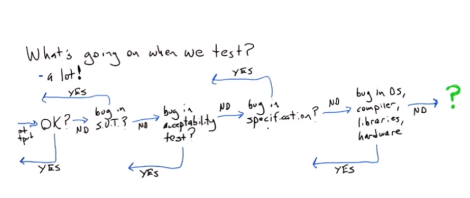

# Software testing

## What is testing?
When a test failed, it is because (sorted by likely occurrence order) :
- The SUT is buggy
- The acceptance criteria are buggy (expected tests output are not okay)
- The specification is not right
- Bug in os, compiler, libraries, hardware

Mars climate orbiter crashed because NASA software powered by Lockheed Martin expected metric units but the underlying platform expected english units (ft/s) so specification bug.

### Equivalent tests
Writing a test that represents a whole class of actual executions of the SUT.  
If 2 tests run through the same exact lines of code, they are equivalent.  
To write a non equivalent test, we have to test other branches of code.  

## Assertions
- Assertions are not for error handling. Check something that is expected to be true in the program
- They should have no side effects (call a function that change a global variable or field in a class). Because they may be disable in production code.
- No silly assertions: assert (1 + 1) == 2

Check something that could be wrong if the logic of the written behaviour is broken  
